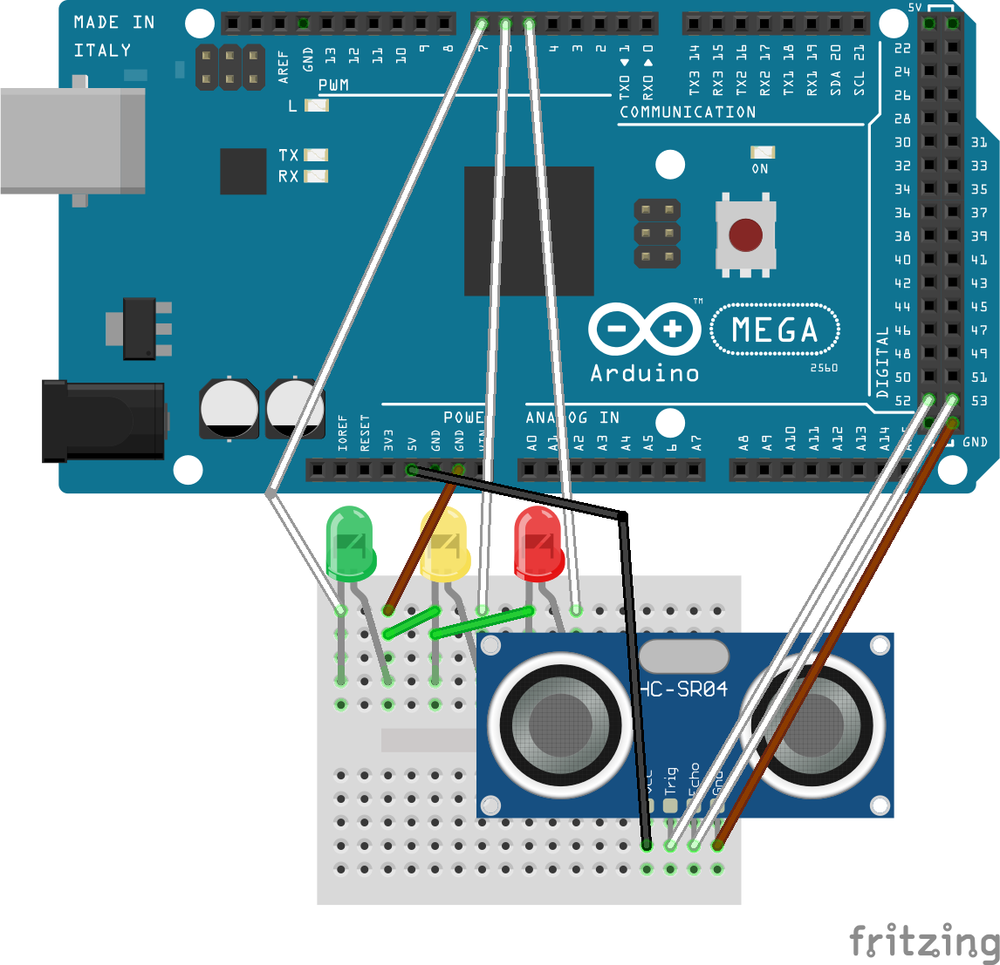

# Mini Proximity Sensor

That's my first project on Arduino, a mini proximity sensor that turns the green led on when an object is 30 centimeters close or less from the ultrasonic sensor, if the object is 24 centimeters close the green LED will blink. Below 20 centimeters it's the yellow LED that turns on and below 14 centimeters it will blink. I let you guess what's happens when the object is 10 centimeters close.

This project will have some improvements in the future.

## Getting Started

This shows you what you need to make this little project. 

### Prerequisites

* [Arduino Software](https://www.arduino.cc/en/Main/Software)
* Arduino MEGA 2560 (it's recommanded to begin with Arduino)
* USB cable Type-A to Type-B (often called printer cable)
* 1 mini breadboard
* 10 wires
* 1 green LED
* 1 yellow LED
* 1 red LED
* 1 ultrasonic sensor HC-SR04

### Installing

You just need to install the Arduino Software

### How to use the Arduino

Take a look to the [Arduino Getting Started](https://www.arduino.cc/en/Guide/ArduinoMega2560), if you don't want to, the steps are written below.

First, you have to launch the Arduino software and connect the Arduino to the computer using the USB A/B cable and atfer that you have to make sure that you selected the right board.
```
Tools ---> Board: Arduino/Genuino Mega or Mega 2560
```
Then, you need to know if it's recoginzed by the computer.
```
Tools ---> Port ---> COMx Arduino/Genuino Mega or Mega 2560
```
You may want to test the Arduino. We'll test it by blinking the built-in **L** LED (pin 13). Open the blink example.
```
Example ---> 01.Basics ---> Blink
```
Finally, you have to upload the data to the Arduino, by clicking the arrow button.


The uploading is done when you see "Done uploading".
If the LED start blinking in orange you are ready to test other programs.

To stop the program just create a program which only contains the functions **setup()** and **loop()** and upload it to the Arduino.

## Mini Proximity Sensor

Open mini_proximity_sensor.ino.

### Setup the Arduino

Just Follow the branchings below.



### Enjoy!

Upload the program to the Arduino and test it by approaching an object near the sensor.
If you want to modify the distance to light up the LED go to the 3 functions that turns the LEDs on, by example the function for the green led is g_led() is this one:
```C++
void g_led(float distance)
{
    if (distance > 30) {
      digitalWrite(green_led, LOW);
      digitalWrite(yellow_led, LOW);
      digitalWrite(red_led, LOW);
      
  } else if (distance <= 30 && distance > 24) {
      digitalWrite(green_led, HIGH);
      digitalWrite(yellow_led, LOW);
      digitalWrite(red_led, LOW);
  } else if (distance <= 24 && distance > 20) {
      digitalWrite(green_led, HIGH);
      delay(80);
      digitalWrite(green_led, LOW);
      delay(80);
  }
}
```

I let you play with the code. If you find some improvements to do with my code or on the arduino branchings you can do a push request.

Thank for reading this readme.
